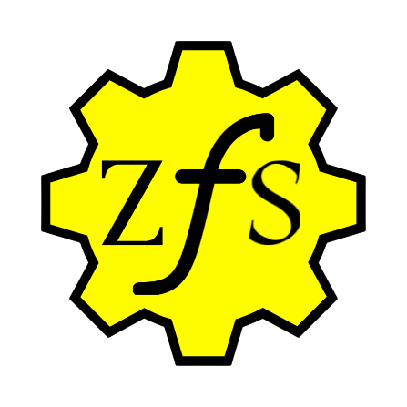

<p align="center">
  
</p>

# ZeroTraceFW Architecture

## 1) Three-Layer Architecture

ZeroTraceFW is structured into three layers to separate interface, policy/orchestration, and cryptographic persistence.

```text
+------------------------------------------------------------------+
| Layer 1: Interface                                                |
| main.py, zerotracefw/ui.py                                        |
| - Session lifecycle, command loop, status, prompts               |
+------------------------------------------------------------------+
| Layer 2: Control + Policy                                         |
| zerotracefw/auth.py, zerotracefw/sync.py, zerotracefw/triggers.py, zerotracefw/audit.py |
| - Authentication, sync decisions, trigger evaluation, audit trail |
+------------------------------------------------------------------+
| Layer 3: Crypto + Storage                                         |
| zerotracefw/encryption.py, zerotracefw/key_derivation.py, zerotracefw/filesystem.py, zerotracefw/container.py, zerotracefw/wipe.py |
| - AES/PBKDF2, encrypted file entries, persistence, secure wipe    |
+------------------------------------------------------------------+
```

## 2) Data Flow

### A) File Ingestion Path

```text
User creates/edits file in mount/
        |
        v
SyncEngine scans and detects change
        |
        v
VirtualFileSystem add_file/update_file
        |
        v
KeyDerivation derives per-file key from master password + salt
        |
        v
EncryptionEngine encrypts file raw bytes with AES-256-CBC + fresh IV
        |
        v
ContainerManager save_state -> data/container.pkl
```

### B) File Read Path

```text
CLI read command
   |
   v
VirtualFileSystem read_file
   |
   +--> increments read_count and updates last_read_at
   |
   v
Decrypt ciphertext with derived key + stored IV
   |
   v
Return plaintext to CLI (session memory only)
```

### C) Trigger Destruction Path

```text
TriggerEngine check_all
   |
   +--> file trigger? destroy file entry + wipe mount file
   |
   +--> global trigger? wipe mount + wipe container + clear VFS
   |
   v
AuditLogger records TRIGGER_FIRE and DESTRUCTION/WIPE_COMPLETE
```

### D) Explorer Command Queue Path (Windows)

```text
File Explorer right-click action
        |
        v
tools/ztfs_cmd.ps1 writes command JSON into .zerotracefw/commands
        |
        v
main.py loop reads and executes queued command
        |
        v
Result JSON written to .zerotracefw/processed
```

### E) Runtime Status Snapshot Path

```text
main.py cycle
        |
        v
Build runtime snapshot (files, auth counters, trigger timers, command queue state)
        |
        v
Write .zerotracefw/status.json
        |
        v
Control panel and external tooling read status for live UI
```

## 3) Encryption Pipeline Details

1. File content is read as raw bytes.
2. 32-byte salt is generated per file entry.
3. PBKDF2-HMAC-SHA256 derives a 32-byte key from master password and salt.
4. 16-byte random IV is generated per encryption operation.
5. AES-256-CBC encrypts raw payload.
6. Entry stores ciphertext, IV, salt, key, and metadata.
7. Only encrypted data and metadata are persisted in container.pkl.

### Cryptographic Parameters

- Cipher: AES-256-CBC
- Key size: 32 bytes
- IV size: 16 bytes
- KDF: PBKDF2-HMAC-SHA256
- PBKDF2 iterations: 10,000

## 4) Trigger Evaluation Flowchart

```text
Start cycle
  |
  v
Check global triggers (global TTL, dead man's switch)
  |
  +-- triggered --> full vault destruction path
  |
  +-- not triggered --> iterate each file metadata
                        |
                        +-- TTL expired? yes -> destroy file
                        |
                        +-- read limit exceeded? yes -> destroy file
                        |
                        +-- deadline reached? yes -> destroy file
                        |
                        +-- no trigger -> keep file
```

## 5) Secure Deletion Protocol

For each file destruction:

1. Determine file size.
2. Overwrite full file with random bytes (pass 1).
3. Overwrite full file with different random bytes (pass 2).
4. Overwrite full file with different random bytes (pass 3).
5. Overwrite full file with zeros (pass 4).
6. Truncate file.
7. Delete file from filesystem.
8. Drop file entry from encrypted vault.
9. Overwrite and clear key/IV/salt material for destroyed entry.

For full system destruction:

1. Wipe all files in mount/.
2. Wipe data/container.pkl.
3. Clear VFS entries and trigger audit logs.
4. Force garbage collection.

## 6) Authentication Flow

```text
Startup
  |
  v
Load auth state
  |
  v
User enters password
  |
  +-- hash == master_hash -> grant access, reset failed count
  |
  +-- hash == duress_hash -> immediate full destruction, cover message
  |
  +-- else failed_attempts++
          |
          +-- failed_attempts >= max_attempts -> lockout destruction
          +-- otherwise deny with attempts remaining
```

## 7) State Persistence Model

State is persisted as a single pickle payload:

```text
{
  "vfs_data": vfs.serialize(),
  "auth_data": auth.serialize(),
  "trigger_data": triggers.serialize(),
  "audit_data": audit.serialize(),
  "version": "1.0.0",
  "created_at": datetime.now(timezone.utc).isoformat()
}
```

Persistence characteristics:

- Cross-session loading via pickle.
- Component-level deserialize methods restore class state.
- Timestamps are serialized as ISO-8601 strings and re-parsed.

## 8) Security Considerations

- Plaintext persistence risk is reduced by wiping mount/ on lock/quit and destructive events.
- The local host, editor extensions, swap, and backups may still capture plaintext outside process control.
- Secure wiping effectiveness depends on filesystem and hardware (journaling, SSD wear leveling).
- Master password exists in process memory during unlocked session.
- Audit logs are persisted as structured entries for accountability, not confidentiality.

## 9) Operational Notes

- The runtime loop is cooperative in a single Python process.
- Sync and trigger checks execute on each cycle and around command handling.
- External command ingestion is file-based and polled each cycle from .zerotracefw/commands.
- Runtime health/state is exported each cycle to .zerotracefw/status.json.
- For high-assurance environments, complement this project with OS-level hardening and dedicated secret-management controls.
